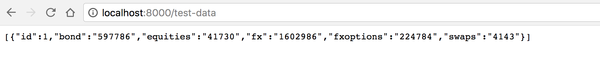

# high-chart-node.js

## To use this repo
1. run ```createdb high_chart_dev```.
2. run ```knex migrate:latest && knex seed:run```
3. run ```node server.js```


This is a high-chart-demo back end with excel data. 


